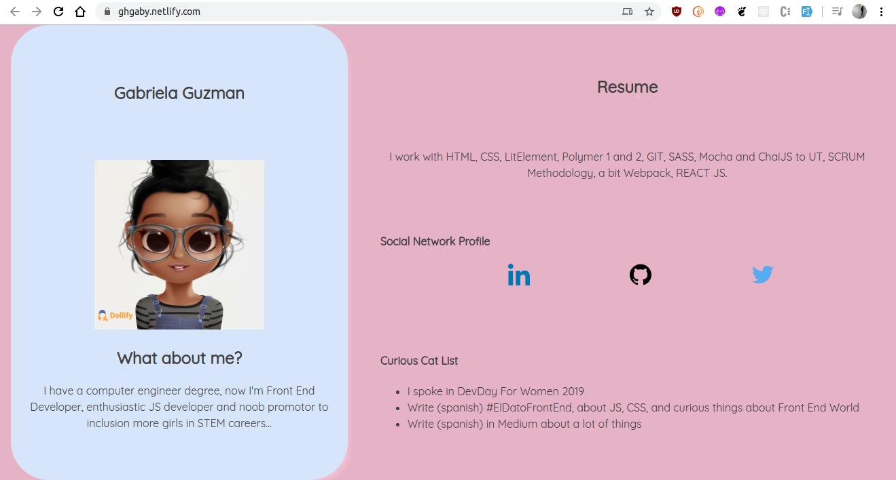

### Code by Gaby
Thanks to visit!!

To see this project in action visit [https://gghbit.netlify.com/](https://gghbit.netlify.com/) or if you want how run in your computer please use polymer-cli.

Color Palette: [https://colorhunt.co/palette/158293]

Iconos: Pixel Perfect [https://www.flaticon.es/packs/logos-and-brands]

```bash
polymer serve
```



